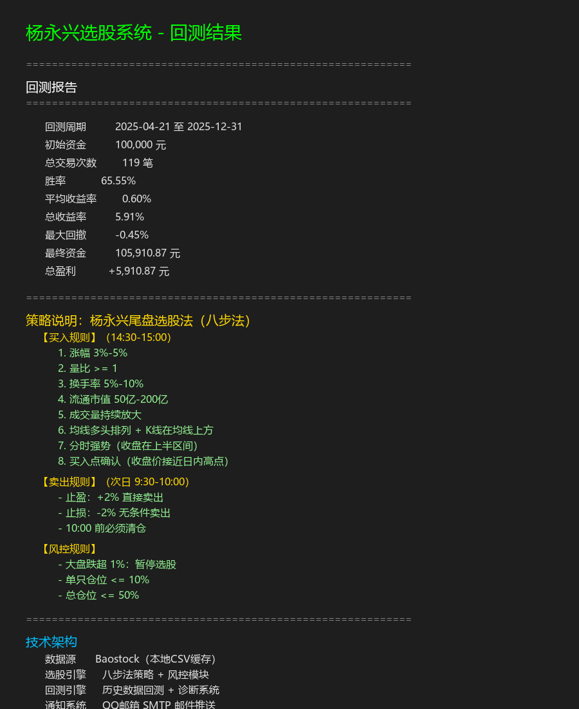

# 杨永兴"一夜持股法"选股系统

基于知名投资者杨永兴的"尾盘买入、次日卖出"策略实现的A股自动化选股系统。

## 系统概述

本系统实现了完整的股票量化交易流程：
- **数据获取**：从Baostock获取A股行情数据，支持本地CSV缓存
- **选股引擎**：八步法策略筛选标的，包含多重风控机制
- **回测引擎**：历史数据回测 + 诊断系统，量化评估策略表现
- **通知系统**：QQ邮箱SMTP邮件推送买卖信号

## 技术栈

- **语言**：Python 3.x
- **核心库**：pandas、numpy、baostock
- **数据源**：Baostock（免费）
- **通知**：SMTP邮件推送
- **平台**：Windows（支持任务计划程序定时运行）

## 回测结果

**Demo模式回测**（2025-04-21 至 2025-12-31）：

| 指标 | 数值 |
|------|------|
| 总交易次数 | 119 笔 |
| 胜率 | 65.55% |
| 平均收益率 | 0.60% |
| 总收益率 | 5.91% |
| 最大回撤 | -0.45% |
| 初始资金 | 100,000 元 |
| 最终资金 | 105,910.87 元 |



## 核心策略

### 买入规则（14:30-15:00 尾盘选股）

| 步骤 | 条件 | 说明 |
|------|------|------|
| 1 | 涨幅 3%-5% | 过滤暴涨暴跌股 |
| 2 | 量比 >= 1 | 成交量活跃 |
| 3 | 换手率 5%-10% | 适度活跃，非冷门股 |
| 4 | 流通市值 50亿-200亿 | 中盘股，弹性好 |
| 5 | 排除涨停股 | 过滤一字板 |
| 6 | 成交量持续放大 | 近3天量能递增 |
| 7 | 均线多头排列 | MA5>MA10>MA20>MA60 |
| 8 | 分时强势+买入点确认 | 收盘在日内高位区域 |

### 卖出规则（次日 9:30-10:00）

- **止盈**：+2% 直接卖出
- **止损**：-2% 无条件卖出
- **时间止损**：10:00 前必须清仓

### 风控规则

- 大盘跌超 1%：暂停选股
- 单只仓位 <= 10%
- 总仓位 <= 50%
- 自动过滤ST股、停牌股

## 快速开始

### 1. 安装依赖

```bash
pip install -r requirements.txt
```

### 2. 配置邮箱

编辑 `config.py`，填写 QQ 邮箱授权码：

```python
EMAIL_CONFIG = {
    'smtp_server': 'smtp.qq.com',
    'smtp_port': 465,
    'sender': 'your_email@qq.com',
    'password': 'your_auth_code',  # QQ邮箱授权码
    'receiver': 'your_email@qq.com'
}
```

**获取授权码**：QQ 邮箱 → 设置 → 账户 → POP3/SMTP 服务 → 生成授权码

### 3. 运行回测

```bash
# Demo模式（使用模拟数据）
python main.py --backtest --demo

# 真实回测（需先下载数据）
python main.py --backtest --start 20250421 --end 20251231
```

### 4. 运行选股

```bash
# 手动选股（交易日 14:30 后使用）
python main.py --select
```

### 5. 设置定时任务（Windows）

1. 打开"任务计划程序"
2. 创建基本任务：
   - **名称**：杨永兴选股系统
   - **触发器**：每天 14:30
   - **操作**：启动程序
     - 程序：`python`
     - 参数：`C:\Users\你的用户名\stock_selector\main.py --select`
     - 起始于：`C:\Users\你的用户名\stock_selector`

## 文件结构

```
stock_selector/
├── config.py              # 配置文件（邮箱、选股参数、回测参数）
── config.json            # 持久化配置（自动生成）
├── main.py                # 主程序入口
├── data_fetcher.py        # 数据获取模块（本地CSV）
├── selector.py            # 选股引擎（八步法）
├── backtester.py          # 回测引擎（含诊断系统）
├── notifier.py            # 邮件推送模块
├── requirements.txt       # Python依赖
├── README.md              # 项目说明
└── 截图/
    └── 回测结果.png       # 回测结果截图
```

## 数据源说明

**当前方案：Baostock**
- 优点：完全免费，无需注册
- 缺点：查询速度慢，周末无数据
- 适用场景：交易日 14:30 后选股

**替代方案**：
1. **Tushare Pro**：实时数据，需注册（约¥500/年）
2. **新浪财经接口**：免费但不稳定
3. **同花顺 API**：需开通量化权限

## 注意事项

1. **数据延迟**：Baostock 数据有延迟，适合尾盘选股
2. **回测局限**：Demo 模式使用模拟数据，真实回测需完整历史数据
3. **风险提示**：本系统仅供学习参考，实盘操作需自行承担风险
4. **手动下单**：系统仅提供信号提醒，需手动在同花顺等软件下单

## 下一步优化

- [ ] 优化数据获取速度（批量接口）
- [ ] 接入完整历史数据进行真实回测
- [ ] 添加实时监控面板
- [ ] 接入同花顺 API 实现自动下单
- [ ] 增加更多技术指标筛选条件
- [ ] 支持多策略组合回测

## 问题排查

**Q：邮件发送失败？**
A：检查 QQ 邮箱授权码是否正确，确保开启了 SMTP 服务

**Q：选股结果为空？**
A：周末无交易数据，请在交易日 14:30 后测试

**Q：数据加载慢？**
A：正常现象，大量股票数据需逐文件读取，可使用 Demo 模式快速验证

## 免责声明

本系统仅供学习研究使用，不构成任何投资建议。股市有风险，投资需谨慎。使用者需自行承担所有交易风险。
